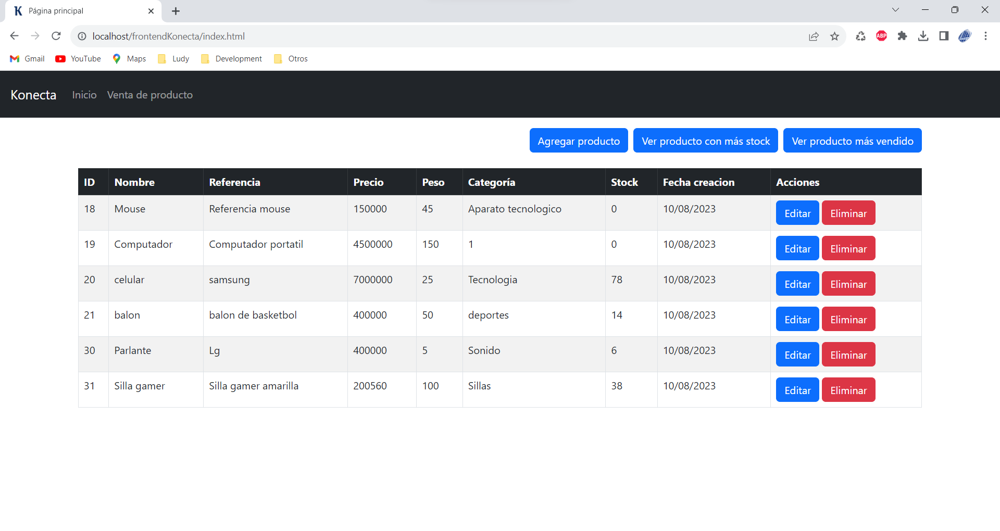

# Prueba técnica konecta
A continuación se listaran los pasos necesarios para ejecutar esta prueba.
Consideraciones a tener en cuenta:
- La prueba se realizó con el framework spring-boot de java
- Por falta de tiempo el frontend de la prueba se realizó en HTML y Javascript básico
- Como motor de base de datos se utilizó MySQL
- Se recomienda usar [visual studio code](https://code.visualstudio.com/) para lanzar y ejecutar el servidor java
## Pasos para ejecutar la prueba
1. Descargar xampp o cualquier otra aplicación que proporcione un servidor local
2. La carpeta `frontendKonecta` (que contiene el aplicativo web) debe alojarla dentro de la carpeta interna del servidor local, si se descarga xampp la ruta es la siguiente:

	> C:/xampp/htdocs

3. Ejecutar xampp o el aplicativo que se haya elegido, y encender el servidor `apache` y el módulo `MySQL`
4. Una vez encendido estos dos servicios diríjase al módulo de configuración de MySQL que se encuentra en la siguiente ruta web:

	> http://localhost/phpmyadmin/

5. Cree una nueva base de datos y asegúrese de elegir como cotejamiento `utf8mb4_unicode_ci`
6. Importe el archivo `pruebaconecta.sql` que contiene las tablas de la base de datos
7. La carpeta `pruebaKonecta` contiene el código Java, antes de lanzar el servidor java dirijase al archivo `application.properties` que se encuentra en la siguiente ruta:

	> pruebaKonecta\src\main\resources

8. En el archivo `application.properties` cambiar las siguientes líneas:

	```properties
	spring.datasource.url=jdbc:mysql://localhost:3306/nombre_que_puso_a_la_base_de_datos #cambie el puerto segun sea necesario
	server.address=xxx.yyy.z.aa #ip del equipo
	```

9. Ahora si está listo para lanzar el servidor java, ejecute el siguiente comando en la cmd

	```shell
	mvnw.cmd spring-boot:run
	```

10. En la carpeta `frontendKonecta` (que contiene el aplicativo web) abra el archivo main.js y cambie la siguiente linea

    ```javascript
    const baseUrl = "http://xxx.yyy.z.aa:PORT"; //Url base del servidor
    ```

11. Diríjase en la web la siguiente ruta

	> http://localhost/frontendKonecta/

Si todo sale bien debería ver lo siguiente:


